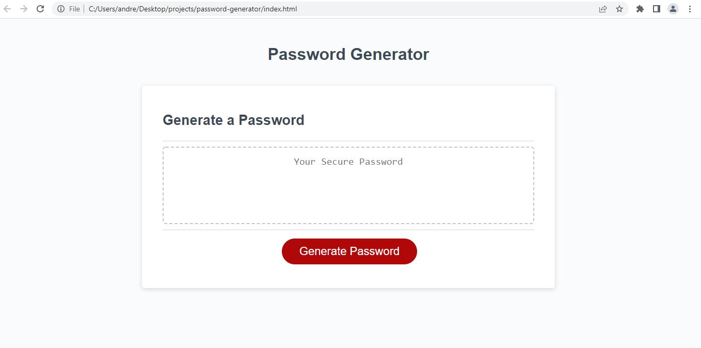

# password-generator

## Purpose

The purpose of this webpage is to generated a random password between 8 and 128 characters.
The user is able to select the password length and whether or not to include Uppercase or Lowercase letters, number, and special characters.
If the user chooses a password length less than 8 or more than 128, the receive an alert asking them to choose a number between 8 and 128.
Once the password length is determined, there are 4 pop-up windows that appear asking the user to confirm whether or not they'd like to use each different character option.

## Built With
*HTML
*CSS
*JS

### Web link:

### Screenshot

